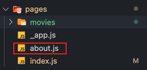
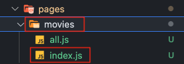
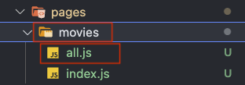
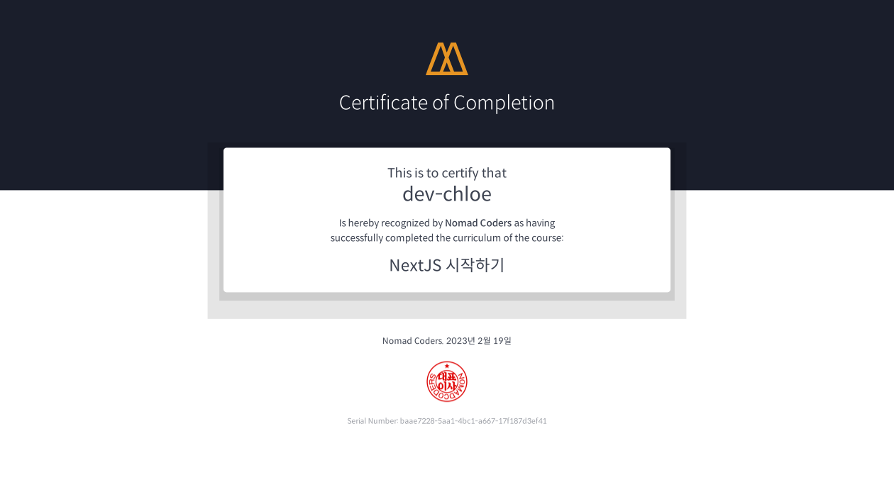

# hangout-nextjs-with-nomad

[NextJS 시작하기](https://nomadcoders.co/nextjs-fundamentals)로 따라한 과정

## Quick start

### Save API Key on local only

```bash
# At the root of repository
# Set environment variable
export API_KEY="YOUR_KEY_VALUE"
env | grep "API_"

# Check exist template
cat .env.template
# Check before execute
envsubst < .env.template

# Create .env file to use local only
envsubst < .env.template > .env
# Check result
cat .env

# (option) Unset environment variable
unset API_KEY
```

### Run your applciation

```bash
# At the root of repository
# Clean Install - dependencies without fixing lock files for same version
npm ci

# Start Next.js Application
npm run dev
```

---

## library vs framework

- library
  - 정해진 규칙은 크게 없으며 언제든지 불러서 원하는 방식으로 사용할 수 있다.
  - 사용자가 원하는 특정 기술의 함수/객체/모듈 세트를 말한다.
- framework
  - famework가 제공하는 규칙에 따라 사용할 수 있다.
  - 사용자가 사용자 지정 응용 프로그램을 만들기 위해 작성하는 개방형 또는 구현되지 않은 기능 또는 개체를 정의해둔다.
  - famework는 그 자체가 응용 프로그램이기 때문에 더 넓은 범위를 가지고 있으며 사용자의 필요에 따라 사용자 응용 프로그램을 만드는 데 필요한 거의 모든 것을 포함한다.

## pages

- next.js에서 `pages`에 파일들을 넣어서 파일 명에 따라 url을 생성한다.
- 중요한 것은 파일의 이름과 컴포넌트는 `export default`가 되어야 한다는 것이다.

  ```javascript
  // export default가 있어야함
  export default function Home() {
    return "hi"
  }

  // export default가 없으면 페이지가 렌더되지 않음
  function Home() {
    return "hi"
  }
  ```

- next.js는 없는 url로 가게 되면 404 페이지를 제공해 준다.

## Static Pre Rendering

- react.js 는 client-side-render를 이용하며 이는 사용자의 브라우저가 사용자가 보는 UI를 모두 만든다.
- client-side-render에서 HTML 파일은 텅빈 파일이며 script가 들어오면서 화면을 렌더링하게 된다. 따라서 느린 환경에서는 흰색화면을 바라보는 시간이 길어진다.
- next.js에서는 pre-rendering을 통해서 실제 HTML이 존재해 화면에 보여지게 되는 것을 확인할 수 있다. 따라서 느린 환경이거나 스크립트가 비활성화된 환경에서도 흰색 화면이 아닌 화면을 사용자가 확인할 수 있다.
- pre-rendering을 통해서 seo 친화적으로 사이트를 만들기가 가능하다.

## Link with a tab

- 13버전 이후로 `<Link>`안에  `<a>` 없이 사용할수 있도록 변했다.
- jsx를 사용할 때 a 태그를 읽을 수 없어서 css가 적용이 안 된다.
- legacyBehavior를 사용하여 `<a>`를 넣어 읽게 할 수 있다.

```javascript
export default function NavBar() {
  const router = useRouter();
  return (
    <nav>
      <Link href="/" legacyBehavior><a>Home</a></Link>
      <Link href="/about" legacyBehavior><a>About</a></Link>
      <style jsx>{`
        a {
          text-decoration: none;
        }
      `}</style>
    </nav >
  )
}
```

[참조](https://nextjs.org/docs/api-reference/next/link#if-the-child-is-a-tag)

## _app.js

- next.js는 `_app.js`를 통해 page를 초기화 한다.
  1. 페이지 변경 간에 레이아웃 유지
  2. 페이지 탐색 시 state 유지
  3. componentDidCatch를 사용한 Custom 에러 처리
  4. 페이지에 추가 데이터 삽입
  5. Global CSS 추가
- 파일명.module.css 파일 형태를 제외한 모든 나머지 css파일들은 _app.js에서만 import해와서 사용해야 한다. (글로벌 css간의 충돌을 피하기 위해서이다.)

## patterns

1. `Laybout.js`

    - `_app.js`는 global로 import 해야할 것들이 많이 있다. (ex, Google Analytics와 검색 엔진에 관한 것들)
    - `_app.js` 파일이 커지는 것을 방지하기 위해서 `Laybout.js` 파일을 만들어 큰 틀을 만든다.

      ```javascript
      import NavBar from "./NavBar";

      export default function Layout({ children }) { // children은 component를 말한다.
        return (
          <>
            <NavBar /> 
            <div>{children}</div>
          </>
        )
      }
      ```

2. `Head component`

    - React.js 같은 경우 app의 head 부분을 관리하기 위해서는 react helmet 같은 또다른 라이브러리를 사용해야한다. 이 말은 현 프로젝트와는 별개인 새로운 컴포넌트, 코드, 오류 등이 생길 수 있다는 뜻이다.
    - `next/head`는Next.js가 제공하는 패키지이다.
    - 이는 더 많은 prop들을 넣어서 개인화를 하여 만들수 있다. (다른 태그나, Meta Description, 또는 작성자 정보 등)

      ```javascript
      import Head from "next/head";

      export default function Seo({ title }) {
        return (
          <Head>
            <title>{title} | Next Movies</title>
          </Head>
        )
      }
      ```

## Redirect and Rewrite

- next.config.js 에서는 커스텀 설정이 가능하다.

1. Redirect

    - Redirect을 사용하면 들어오는 request 경로를 다른 destination 경로로 Redirect할 수 있다.

      ```javascript
      module.exports = {
        reactStrictMode: true,
        async redirects() {
          return [
            {
              source: "/contact", // 입력되는 주소
              destination: "/form", // 포워딩 되는 곳
              permanent: false
            },
            {
              source: "/old-blog/:path*", // /old-blog/1221/cont/23
              destination: "/new-blog/:path*", // /new-blog/1221/cont/23
              permanent: false
            }
          ]
        }
      }
      ```

2. Rewrite

    - Rewrites를 사용하면 들어오는 request 경로를 다른 destination 경로에 매핑할 수 있다.

      ```javascript
      const API_KEY = process.env.API_KEY;
      module.exports = {
        reactStrictMode: true,
        async rewrites() {
          return [
            {
              source: "/api/movies",
              destination: `https://api.themoviedb.org/3/movie/popular?api_key=${API_KEY}&language=en-US&page=1`,
            }
          ]
        }
      }
      ```

## Server Side Rendering

- next.js에서 Server Side Rendering을 하기 위해서 `getServerSideProps`를 사용한다.
- `getServerSideProps`는 오직 server side 에서만 동작한다.
- `getServerSideProps`는 json 데이터를 반환하며 이는 각 페이지에 렌더링 되기 위해 사용된다.
- `getServerSideProps`는 매 요청마다 데이터가 반드시 패칭되어야 하는 페이지를 렌더링 할 때 사용된다.

## Dynamic Routes

- next.js에서 라우팅을 하기 위해서는 pages안에 파일이나 폴더를 생성하면된다.

  > `/about` 페이지 만들기
  >
  > 
  >
  > `/movies` 페이지 만들기
  >
  > 
  >
  > `/movies/all` 페이지 만들기
  >
  > 

## Link

- `Link'를 이용하여 페이지 이동을 하고 데이터를 넘길 수 있다.

```javascript
<Link href={{
        pathname: `movies/${movie.id}`,
        query: {
          title: movie.original_title,
        }
      }}
      as{`movies/${movie.id}`}
>
  <h4>{movie.original_title}</h4>
</Link>
```

- `router.push()'를 이용하여 페이지 이동을 하고 데이터를 넘길 수 있다.

```javascript
const router = useRouter();
const onClick = (movie) => {
  router.push({
    pathname: `movies/${movie.id}`,
    query: {
      id: movie.id,
      title: movie.original_title
    }
  }, `movies/${movie.id}`)
}
return (
    <div className="container">
      {results?.map(movie =>
        <div className="movie" key={movie.id} onClick={() => onClick(movie)}>
          
          <h4>{movie.original_title}</h4>
        </div>
      )}
    </div >
  )
```

## params and router

- `[...prrams].js` 파일을 만들면 next.js 서버는 { params: { parmas: [] } } 객체를 만든다.  
- `localhost:3000/movies/****/****` 형식의 url 주소로 가면 서버에 { params: { parmas: [] } } 객체가 생성된다.
- 이 객체를 이용하려면 아래 두 가지가 있다.
  1. router를 이용하는 방법(router.query.params)
  2. getServerSideProps()를 이용하는 방법

## 404 page

- page 폴더 밑에 `404.js`파일을 생성하여 커스텀 페이지로 만들 수 있다.

## 이전 git 삭제

  ```bash
  # git 캐시 삭제
  git rm --cached -r .      

  # check
  git status

  # 올리기
  git add .  
  git commit --amend --no-edit      
  git push -u origin $(git branch --show-current) -f
  ```

## certification

[](https://nomadcoders.co/certs/baae7228-5aa1-4bc1-a667-17f187d3ef41)
